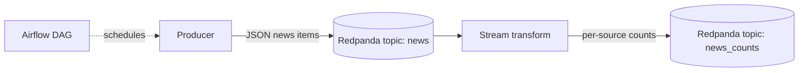

# {{ arc_name }} demo

A weekend-sized streaming demo emitted by [stack-quest](https://github.com/michaelpawlus/stack-quest).

## What this is

This repo is the portfolio artifact for the `{{ arc_name }}` learning arc. It
closes the following beacon skill-gap quests: **{{ closes_quests | join(", ") }}**.

The exercises that produced this demo:


- **{{ ex.id }}** — {{ ex.prompt | replace("\n", " ") | trim }}


## Architecture



## Run it

```bash
docker compose up -d
python producer.py        # exercise 01
python transform.py       # exercise 02
# Airflow DAG lives in dags/  (exercise 03)
```

## What I learned

_(Replace this section with 3-5 sentences on what was non-obvious. Examples:
the difference between event-time and processing-time windows, why Redpanda
needs `--advertise-kafka-addr`, why Airflow's CeleryExecutor is overkill for
local dev, etc.)_

## See also

- [WALKTHROUGH.md](./WALKTHROUGH.md) — script for a 5-minute Loom walkthrough
- [CLAUDE.md](./CLAUDE.md) — agent instructions for this repo
